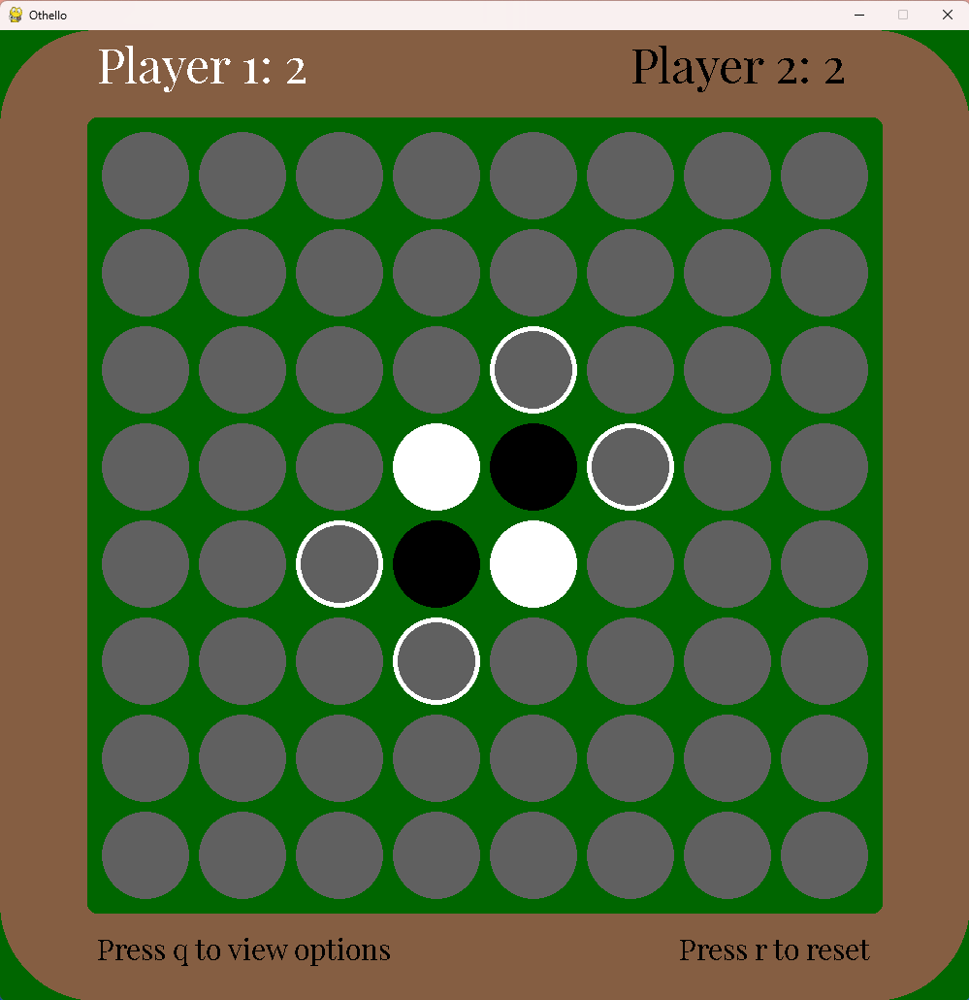

# OthelloPygame

A two-player Othello (Reversi) game built with Python and Pygame.

## Features

- Classic Othello rules, playable locally by two players.
- Players can select and customize the color of their tiles.
- Intuitive GUI powered by Pygame.
- Visual feedback for valid moves, score, and end-of-game results.

## Installation

1. **Clone the repository:**
   ```bash
   git clone https://github.com/tdawson97/OthelloPygame.git
   cd OthelloPygame
   ```

2. **Install dependencies:**
   - Requires Python 3.x
   - Install Pygame:
     ```bash
     pip install pygame
     ```

## Running the Game

Run the main script:
```bash
python main.py
```

## Screenshots

| Start Screen | Game Options | Making Moves | Mid Game | End Game |
|---|---|---|---|---|
|  |  |  |  |  |

## How to Play

- Take turns placing tiles on the board.
- Flank your opponent’s tiles horizontally, vertically, or diagonally to flip them to your color.
- The player with the most tiles at the end wins!

## Project Structure

- `main.py`: Entry point and game loop.
- `player.py`: Player configuration and logic.
- `tile.py`: Tile and board mechanics.
- `ui.py`: User interface and rendering.
- `settings.py`: Game settings.
- `SCREENSHOTS/`: Sample images of gameplay.

## Credits

Created by [tdawson97](https://github.com/tdawson97).

---

Enjoy playing Othello with this customizable, easy-to-run game!
